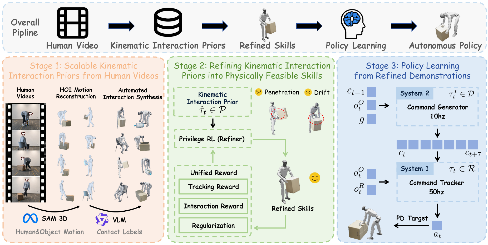

<h1 align="center">
  🍬 SUGAR: A Scalable Human-Video-Driven Generalizable Humanoid Loco-Manipulation Learning Framework
</h1>

<p align="center">
  <a href="https://tianshuwu.github.io/" target="_blank"><strong>Tianshu Wu</strong></a><sup>1*</sup> ·
  Xiangqi Kong<sup>2*</sup> ·
  <a href="https://yuechen0614.github.io/" target="_blank"><strong>Yue Chen</strong></a><sup>1*</sup> ·
  Qize Yu<sup>1</sup> ·
  <a href="https://alvinyh.github.io/" target="_blank"><strong>Hang Ye</strong></a><sup>1</sup> ·
  Jia Li<sup>1</sup> ·
  <a href="https://cfcs.pku.edu.cn/wangyizhou/" target="_blank"><strong>Yizhou Wang</strong></a><sup>1</sup> ·
  <a href="https://zsdonghao.github.io/" target="_blank"><strong>Hao Dong</strong></a><sup>1,✉</sup>
</p>

<p align="center">
  <sup>1</sup> Center on Frontiers of Computing Studies, School of Computer Science, Peking University
  <br>
  <sup>2</sup> School of Computer Science and Engineering, Beihang University
</p>

<p align="center">
  <sup>*</sup> Equal Contribution &nbsp;&nbsp;&nbsp;
  <sup>✉</sup> Corresponding Author
</p>


<p align="center">
  <a href="https://arxiv.org/abs/2605.20373">
    
  </a>
  <a href="https://tianshuwu.github.io/sugar-humanoid/">
    
  </a>
  <a href="./LICENSE">
    
  </a>
</p>


## 📌 Overview
SUGAR is a scalable humanoid loco-manipulation project built upon the IsaacLab manager-based framework. Given third-person videos of human-object interactions, it learns generalizable and deployable humanoid autonomous policies, enabling humanoid robots to solve challenging loco-manipulation tasks in the real-world.
<p align="center">
  
</p>


## 📌 Installation
1. clone repository and create a conda environment
```bash
git clone https://github.com/tianshuwu/SUGAR.git
cd SUGAR
conda create -n sugar python=3.11
conda activate sugar
```

2. install isaacsim
```bash
pip install isaacsim[all,extscache]==5.1.0 --extra-index-url https://pypi.nvidia.com
```
3. install isaaclab
```bash
cd ..
git clone git@github.com:isaac-sim/IsaacLab.git
cd IsaacLab
git checkout v2.3.0
pip install flatdict==4.0.1 --no-build-isolation
./isaaclab.sh --install rsl_rl
```
4. install sugar
```bash
cd ../SUGAR
pip install -e source/sugar_rl
pip install -e source/sugar_il
# for 5090:  pip install torch==2.8.0 torchvision==0.23.0 torchaudio==2.8.0 --index-url https://download.pytorch.org/whl/cu128
```

5. download data
```bash
pip install -U gdown
python -m gdown 1AIJWqS5rFGl5u2Qq6jCCTHKdh51SX2Sc     # 400MB
unzip data.zip
rm data.zip
python -m gdown 1wXNAjNMrfV0e-d2pQ6m9dm4xrG5lSoyD     # 50MB
unzip descriptions.zip
rm descriptions.zip
python -m gdown 1Uc2SPPVvTboEgw4Scyuz3TmzNKDg-dx-     # 250MB
unzip demo_ckpts.zip
rm demo_ckpts.zip
```


## 📌 Run SUGAR
### Inference
```bash
# Optional task: CarryBox, KickBox, PushBox, SitChair, StandBottle, PickBottle
# bash inference.sh TASK_NAME (optional TRACKER_CKPT) (optional GENERATOR_CKPT)
bash inference.sh CarryBox 
```
### Train
```bash
# Optional task: CarryBox, KickBox, PushBox, SitChair, StandBottle, PickBottle
# bash train.sh TASK_NAME (optional EXP_NAME)
bash train.sh CarryBox  
```

## 📌 TODO List
- [x] Release inference demo and checkpoints
- [x] Release the complete training pipeline, including refiner, tracker, and generator
- [x] Release processed data for all six tasks
- [ ] Release the data processing pipeline from RGB-D human videos to training data
- [ ] Release the sim-to-sim pipeline

## 📌 Acknowledgements
This code implementation is based on these excellent open-source projects, thanks to:
* **[unitree_rl_lab](https://github.com/unitreerobotics/unitree_rl_lab) & [beyondmimic](https://github.com/HybridRobotics/whole_body_tracking)**: Serves as the codebase for `sugar_rl`.
* **[dexgraspvla](https://github.com/Psi-Robot/DexGraspVLA)**: Serves as the codebase for `sugar il`.


## 📌 Citation
```bash
@article{wu2026sugar,
  title={SUGAR: A Scalable Human-Video-Driven Generalizable Humanoid Loco-Manipulation Learning Framework},
  author={Wu, Tianshu and Kong, Xiangqi and Chen, Yue and Yu, Qize and Ye, Hang and Li, Jia and Wang, Yizhou and Dong, Hao},
  journal={arXiv preprint arXiv:2605.20373},
  year={2026}
}
```